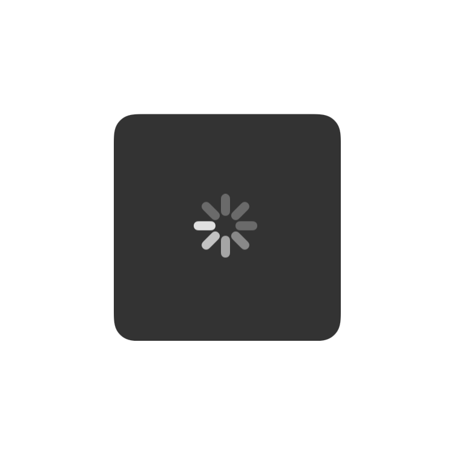
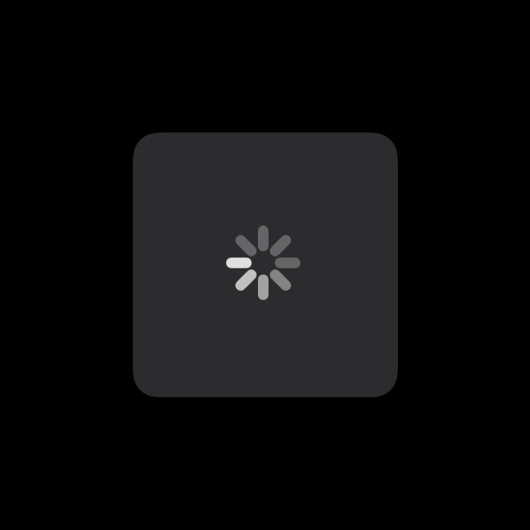

# TJSpinny

Sometimes you want to show a `UIActivityIndicator` view in the middle of a view controller to show that something's happening.

This project does exactly that.

## Features

- Dead simple API.
- Delayed presentation (only start showing after `duration` unless cancelled, useful for not showing the spinny at all for work that *may* occur quickly).
- Dark mode? We got yer dark mode.

|Light Mode|Dark Mode|
|---|---|
|||

- It's a "squircle" shape (aka `kCACornerCurveContinuous`) on iOS 13+.

|Squircle (iOS 13+)|Rounded Rect|
|---|---|
|||

- Built-in support for the iOS ["reduce motion" accessibility setting](https://support.apple.com/en-us/HT202655).
- Written in Objective-C for all you dinosaurs out there. 🦖

---

This project is used in [Opener](https://apps.apple.com/app/id989565871), [Close-up](https://apps.apple.com/app/id515789135), [Burst](https://apps.apple.com/app/id1355171732), and [Checkie](https://apps.apple.com/app/id382356167). It seemed like a common enough thing that it was worth open sourcing.

There are plenty of libraries out there with many more features, but this is all I've ever really needed for my apps!